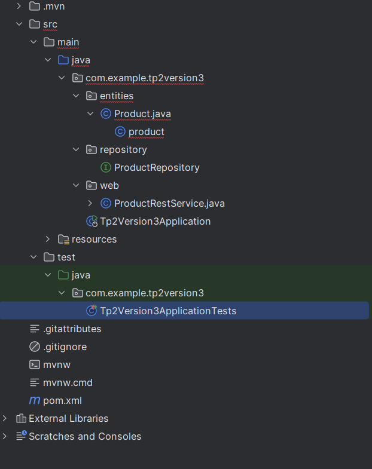
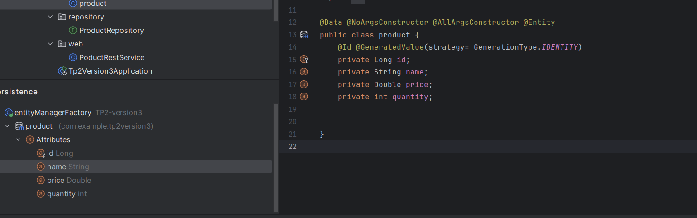
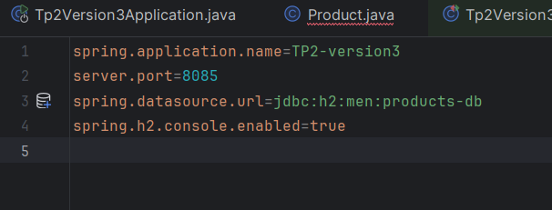

<h1>ORM JPA Hibernate Spring Data</h1>

<h3>Projet réalisé par Zineb Feth-Eddin</h3>

---

<h2>Introduction</h2>

Ce projet consiste à développer une application pour la gestion des utilisateurs et des rôles. L'application utilise <strong>Spring Boot</strong>, <strong>Spring Data JPA</strong>, et <strong>Hibernate</strong> pour gérer les relations entre entités et les opérations CRUD. Les principales fonctionnalités permettent d'ajouter, de consulter et de modifier les utilisateurs ainsi que leurs rôles respectifs.

---

<h2>Fonctionnalités</h2>
<ul>
    <li>Ajouter des utilisateurs et des rôles.</li>
    <li>Assigner des rôles à des utilisateurs.</li>
    <li>Consulter la liste des utilisateurs et des rôles.</li>
    <li>Gérer les relations entre utilisateurs et rôles grâce à une relation <code>@ManyToMany</code>.</li>
</ul>

---

<h2>Structure du Projet</h2>

Le projet suit une architecture modulaire avec les packages suivants :

<h3>1. Package <code>entities</code></h3>
<ul>
    <li>Contient les entités <strong>User</strong> et <strong>Role</strong>, représentant les tables dans la base de données.</li>

    <li>Relation entre les entités :
        <ul>
            <li><code>User</code> et <code>Role</code> : Relation <code>@ManyToMany</code>.</li>
        </ul>
    </li>
</ul>

<h3>2. Package <code>repositories</code></h3>
<ul>
    <li>Contient les interfaces <strong>UserRepository</strong> et <strong>RoleRepository</strong>, héritant de <code>JpaRepository</code>.</li>
    <li>Fournit les opérations CRUD automatiques pour les entités.</li>
</ul>

<h3>3. Package <code>service</code></h3>
<ul>
    <li>Contient les services et leur implémentation :
        <ul>
            <li><code>UserService</code></li>
            <li><code>UserServiceImpl</code></li>
        </ul>
    </li>
    <li>Ces services encapsulent la logique métier de l'application.</li>
</ul>

<h3>4. Fichier <code>application.properties</code></h3>
<ul>
    <li>Contient la configuration de la base de données et des paramètres du projet.</li>
</ul>

---

<h2>Configuration</h2>

<h3>1. Base de Données et Application</h3>

Le projet est configuré pour utiliser la base de données H2 en mémoire. Voici la configuration définie dans <code>application.properties</code> :

<pre>
spring.application.name=TP2-version3
server.port=8085
spring.datasource.url=jdbc:h2:mem:products-db
spring.h2.console.enabled=true
</pre>

  

Vous pouvez accéder à la console H2 via <a href="http://localhost:8085/h2-console">http://localhost:8085/h2-console</a>.

<h3>3. Endpoints API</h3>

<ul>
    <li><code>POST /users</code> : Ajouter un utilisateur.</li>
    <li><code>GET /users</code> : Lister tous les utilisateurs.</li>
    <li><code>POST /roles</code> : Ajouter un rôle.</li>
    <li><code>GET /roles</code> : Lister tous les rôles.</li>
    <li><code>POST /users/{userId}/roles/{roleId}</code> : Assigner un rôle à un utilisateur.</li>
</ul>

---

<h2>Conclusion</h2>

Ce projet démontre l'utilisation des concepts clés de Spring Boot et JPA pour créer une application performante et modulable. Il peut être facilement étendu pour inclure des fonctionnalités supplémentaires comme l'authentification ou la gestion avancée des autorisations.

